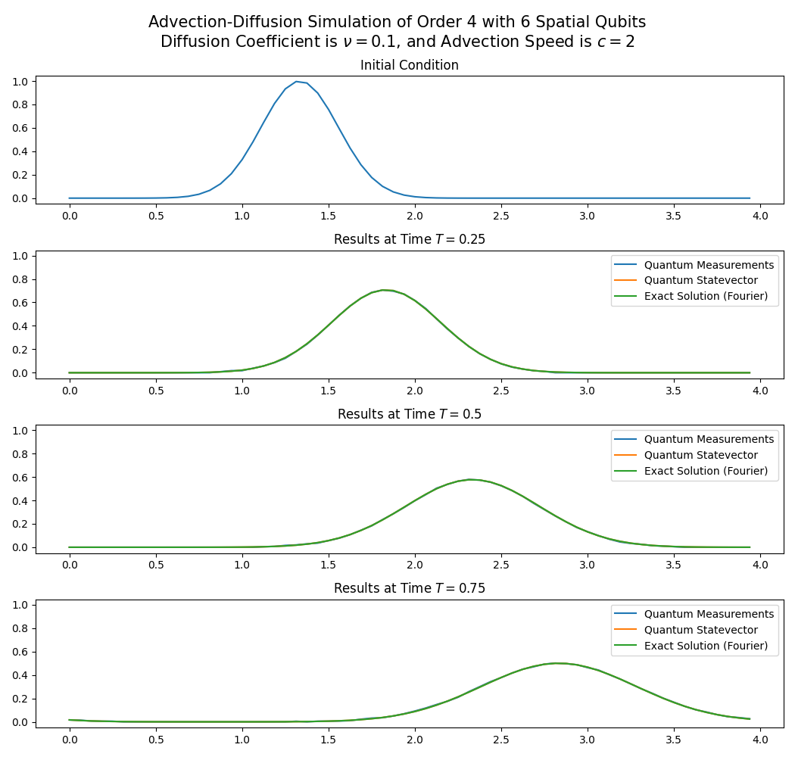
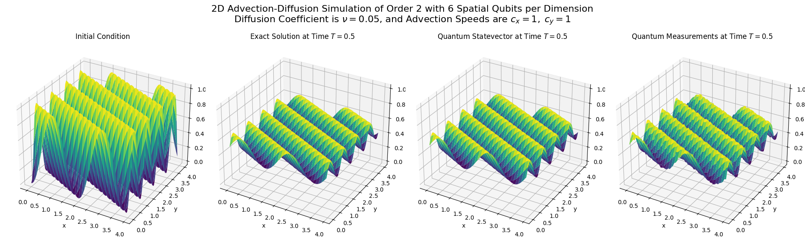

## A Python Package for Quantum Simulation of the Advection-Diffusion Equation

## Introduction
This repository contains Python code for simulating the advection–diffusion equation using quantum circuits and comparing the results to classical Fourier-based approximations. It utilizes Quantum Singular Value Transformation (QSVT) to simulate the evolution of an initial condition under the advection-diffusion dynamics. The package provides both 1D and 2D quantum simulations and supports not only the full advection-diffusion dynamics, but also the pure diffusion and pure advection cases. For these special cases, the QSVT construction is optimized to use the least number of qubits necessary.

#### 1D Advection–Diffusion Equation
```math
u_t + c \, u_x = \nu \, u_{xx}, \quad x \in [0,d], \; t \ge 0
``` 
where $u:\[0,T\]\times\[0,d\]\rightarrow \mathbb{R}$ is the scalar field, $c$ is the advection speed and $\nu$ the diffusion coefficient.

#### 2D Advection–Diffusion Equation
```math
\frac{\partial u}{\partial t} + \mathbf{c} \cdot \nabla u = \nu \, \Delta u, \quad (x,y) \in [0,d]^2, \; t \ge 0,
``` 
where $u:\[0,T\]\times\[0,d\]^2\rightarrow \mathbb{R}$ is the scalar field, $\mathbf{c}=(c_1,c_2)$ the advection velocity vector, and $\nu$ the diffusion coefficient.

---
This repository is organized around the Adv_Diff folder, which contains the main implementation of the quantum advection–diffusion simulation framework. is organized into a small number of Python modules, each handling a different part of the simulation pipeline:
- Fourier-based approximations for baseline,  
- angle sequence construction for QSVT,  
- QSVT circuit construction for advection-diffusion evolution, and  
- simulation drivers for 1D and 2D cases.

In addition to the main Adv_Diff directory, there are supporting modules located at the top level of the repository:
- A usage example demonstrating how to import and run the simulation routines from the Adv_Diff module. (example_code.py)
- A collection of initial-condition functions along with helper methods for running, visualizing, and comparing simulations for different orders. (test_functions.py)

## Overview

- **`Fourier.py`**  
  Implements Fourier approximations of the solution in one and two dimensions. The number of Fourier modes can be fixed or adaptively chosen to achieve a target approximation error. 

- **`Angles_QSVT.py`**  
  Derives the angle sequences used in QSVT for simulating advection, diffusion, or advection–diffusion.  
  - Chebyshev coefficients are obtained via the Jacobi–Anger expansion.  
  - Coefficients are truncated adaptively to meet a given error tolerance.  
  - Final angle sequences are computed using `Angles_symQSP` from the [pyqsp](https://github.com/ichuang/pyqsp) package.  

- **`Adv_Diff_QC.py`**  
  Builds the QSVT quantum circuits that implement the block-encoded advection-diffusion operator.  
  - constructs state preparation gates and block encoding for given method orders (2, 4, 6 or 14).  
  - Separate routines exist for single-angle and dual-angle-sequence QSVT circuits.  

- **`Simulation_QC.py`**  
  Runs quantum simulations of the 1D advection–diffusion equation.  
  - Discretizes the initial condition using a given number of spatial qubits.  
  - Chooses a time discretization which normalizes the block encoding. 
  - selects the least number of ancilla qubits necessary for the given case and method order.
  - Constructs the appropriate QSVT circuit and postselects on ancilla measurements to extract the solution.  
  - plots the quantum results against the Fourier approximation and reports maximal error and success probability 
    for each given final time, as well as gate count if intructed to.

- **`Simulation_QC_2D.py`**  
  Extends the simulation framework to 2D  
  - Assigns equal numbers of qubits to each spatial direction.  
  - Constructs QSVT circuits separately for each direction, roughly doubling the ancilla requirements compared to 1D.  
  - Produces 3D surface plots of the initial condition, Fourier approximation, and quantum result at the final time.  
  - Reports maximal error, success probability, and gate count if instructed to. 

## Examples
To use the repository for simulating advection-diffusion in either 1D or 2D, place the Adv_Diff folder in your working directory, import Simulation_QC or Simulation_QC_2D in your file, and run the Sim() method from the repsective file with your intended parameters specified. See the examples below. 

#### 1D Simulation Example

```python
# Import relevant modules and methods.
import numpy as np
from Adv_Diff import Simulation_QC

# specify parameters for 1D simulation
num_qubits = 6                                      # Number of spatial qubits
times = [0.25, 0.5, 0.75]                           # List of final times (could also be a single value)
adv_speed = 2                                       # Advection speed parameter
diff_coeff = 0.1                                    # Diffusion coefficient
domain_length = 4                                   # Length of spatial domain
init_f = lambda x: np.exp(-10*(x-4/3)**2)           # Initial function
shots = 10**6                                       # Number of measurement shots
report_complexity = True                            # Whether or not to display complexity data
order = 4                                           # Method order
tolerance = 10**(-6)                                # error tolerance when deriving angle sequences
sim_type  = "both"                                  # Type of simulation: "meas" for measurement-based, "sv" for statevector-based, or "both"
compute_exact = True                                # Whether or not to compute and plot the exact solution
plot = True                                         # Whether or not to plot results

# Run 1D simulation with specified parameters. 
Simulation_QC.simulate_adv_diff(num_qubits, times, adv_speed, diff_coeff, domain_length, init_f, shots, report_complexity, order, tolerance, sim_type, compute_exact, plot)
```

This will produce the plot below



It will print the number of fourier modes needed for the exact solution to converge, and for each value in 'times', it will print the succes rate, complexity, max error and some information from the pyqsp's solver. Each simulation is separated by a header stating the final time. Each section of printed information is also indicated by a clear header.
When the simulation is complete for all final times, a table is displayed which summarises, the printed information.

#### 2D Simulation Example

```python
# Import relevant modules and methods.
import numpy as np
from Adv_Diff_new import Simulation_QC_2D

# specify parameters for 2D simulation
num_qubits = 6                                              # Number of qubits per spatial dimension
time = 1                                                    # Final time for evolution
adv_speed_x = 1                                             # Advection speed parameter in x direction
adv_speed_y = 1                                             # Advection speed parameter in y direction
diff_coeff = 0.05                                           # Diffusion coefficient
domain_length = 4                                           # Length of each spatial dimension
init_f = lambda X, Y: np.sin(np.pi * (0.5 * X + Y)) + 1     # Initial function
shots = 10**8                                               # Number of measurement shots
report_complexity = True                                    # Whether or not to display complexity data
order = 2                                                   # Method order
tolerance = 10**(-6)                                        # error tolerance when deriving angle sequences
sim_type  = "both"                                          # Type of simulation: "meas" for measurement-based, "sv" for statevector-based, or "both"
compute_exact = True                                        # Whether or not to compute and plot the exact solution
plot = True                                                 # Whether or not to plot results

# Run 2D simulation with specified parameters. 
Simulation_QC_2D.simulate_adv_diff_2d(num_qubits, time, adv_speed_x, adv_speed_y, diff_coeff, domain_length, init_f, shots, report_complexity, order, tolerance, sim_type, compute_exact, plot)
```

This will produce the plot below



It will also print the number of Fourier modes, succes rate, complexity, max error and some information printed by pyqsp's solver. Each section of printed information is indicated by a clear header.

## Dependencies

- numpy
- matplotlib
- pyqsp
- scipy
- tabulate
- typing

All of the above can be installed using pip install.
For details on the pyqsp package see https://github.com/ichuang/pyqsp
